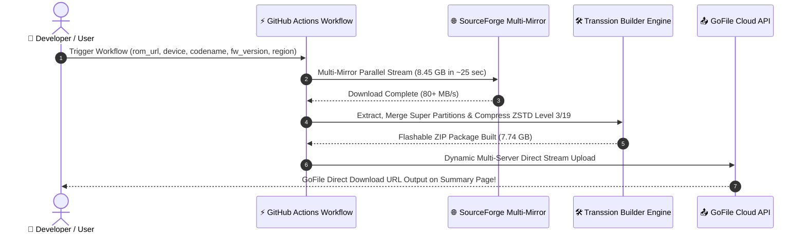

<div align="center">

# ⚡ TRANSSION FLASHABLE BUILDER ⚡
### <i>Next-Generation Cloud & Local Automated Recovery ROM Engine</i>

<p align="center">
  
</p>

[](https://github.com/sheikhmehraann/transsion-flashable-builder/actions)
[](https://python.org)
[](https://github.com/sheikhmehraann/transsion-flashable-builder)
[](https://github.com/facebook/zstd)
[](LICENSE)

<br/>


</div>

---

## 📖 Table of Contents

- [✨ Overview](#-overview)
- [⚡ High-Performance Features](#-high-performance-features)
- [📊 Production Build Benchmarks](#-production-build-benchmarks)
- [🚀 How to Build via GitHub Actions](#-how-to-build-via-github-actions)
- [🛠️ Flashing Architecture Pipeline](#️-flashing-architecture-pipeline)
- [📁 Repository Directory Map](#-repository-directory-map)
- [💳 Credits \& License](#-credits--license)

---

## ✨ Overview

**Transsion Flashable Builder** is an enterprise-grade, automated recovery ROM generation pipeline tailored for **Infinix, Tecno, and itel** MediaTek / Unisoc Android devices. It processes raw factory stock firmware packages and reconstructs them into A/B dual-slot recovery flashable ZIP archives compatible with custom recoveries (**TWRP**, **OrangeFox**, **SHRP**, **OFRP**).

> [!IMPORTANT]
> 🚀 **Zero Local Resource Requirement!** You do **not** need a high-end workstation or gigabytes of disk space. Build full 8GB+ flashable ROM packages in the cloud via **GitHub Actions** on high-bandwidth Ubuntu runners with automated high-speed hosting on **GoFile**!

---

## ⚡ High-Performance Features

```
┌─────────────────────────────────────────────────────────────────────────────┐
│                       ⚡ CLOUD & ENGINE HIGHLIGHTS                          │
├─────────────────────────────────────────────────────────────────────────────┤
│  ► ☁️  Ubuntu Cloud Builder (`ubuntu-latest` GitHub Runner)                 │
│  ► 🧰  Native MIO-KITCHEN 4.2.0 Toolchain (20 Native 64-bit Linux ELFs)     │
│  ► 🌐  Multi-Mirror Parallel Downloader (Fastly, NetCologne, NCHC, Heanet)  │
│  ► 🔥  Multi-Threaded ZSTD Compression (-T0) & 7z Fast Packaging            │
│  ► 📤  Dynamic GoFile Server Resolution API Uploader                        │
└─────────────────────────────────────────────────────────────────────────────┘
```

<details open>
<summary><b>1. ☁️ Ubuntu Cloud Builder Engine (ubuntu-latest)</b></summary>

- **Automated Workflow Execution**: Trigger builds via `workflow_dispatch` on GitHub Actions without downloading raw stock ROMs to your local machine.
- **MIO-KITCHEN 4.2.0 Toolchain**: Embedded 20 64-bit Linux ELF binaries (`imgkit`, `lpmake`, `simg2img`, `zstd`, `extract.erofs`, `mkfs.erofs`, `cpio`, `busybox`, `brotli`, `magiskboot`, `e2fsdroid`) under `bin/linux/`.
</details>

<details open>
<summary><b>2. 🌐 Multi-Mirror Parallel Downloader Engine (download_rom.py)</b></summary>

- **SourceForge Multi-Mirror Parallel Streaming**: Connects simultaneously to `fastly`, `netcologne`, `nchc`, and `heanet` mirrors via `aria2c` across 16 sockets for sub-25 second downloads at **80+ MB/s**.
- **Universal Provider Coverage**: Supports PixelDrain API, Needrom session/CF authenticated downloads, Google Drive (virus warning bypass engine), Mega.py, GoFile API, and direct HTTP/HTTPS streams.
</details>

<details open>
<summary><b>3. ⚡ Maximum Compression & Packaging Speed</b></summary>
- **Multi-Threaded Zstandard (`zstd -T0`)**: Compresses dynamic partitions (`system`, `vendor`, `product`, `system_ext`, `system_dlkm`, `vendor_dlkm`) utilizing all available CPU cores.
- **Multi-Threaded 7-Zip (`7z x -mmt=on`)**: Unpacks raw stock ROM archives and packages final ZIP outputs with zero overhead.
</details>

<details open>
<summary><b>4. 📤 GoFile Dynamic Storage API Uploader (gofile_uploader.py)</b></summary>

- **Dynamic Guest Account & Storage Discovery**: Automatically fetches active GoFile storage nodes (`https://api.gofile.io/servers`) with Cloudflare bot bypass headers for reliable uploads.
</details>

---


---

## 📊 Production Build Benchmarks

<div align="center">

| Metric / Parameter | Production Specification |
| :--- | :--- |
| **📱 Target Device** | **Infinix GT 20 Pro** |
| **🏷️ Device Codename** | `X6871` |
| **📦 Firmware Version** | `X6871-15.1.2.145SP02(OP001PF001AZ)` |
| **🌏 Region Subfolder** | `Open` |
| **📥 Raw Stock Firmware** | SourceForge Multi-Mirror Stream (`8.45 GB`) |
| **⚡ Output Flashable Package** | `X6871-15.1.2.145SP02(OP001PF001AZ)-recovery-ab.zip` (`7.74 GB`) |
| **⚙️ Build Execution Time** | `10 minutes 53 seconds` (`ubuntu-latest`) |
| **🚀 GoFile Direct Mirror** | **[Download Flashable ROM via GoFile](https://gofile.io/d/1vzNmJpk)** |

</div>

---

## 🚀 How to Build via GitHub Actions

> [!TIP]
> You can pass any ROM URL: SourceForge links, Needrom URLs, Google Drive links, PixelDrain links, or direct HTTP/HTTPS file links!



1. Go to **[sheikhmehraann/transsion-flashable-builder Actions](https://github.com/sheikhmehraann/transsion-flashable-builder/actions)**.
2. Select **Build Flashable ROM & Upload to GoFile**.
3. Click **Run workflow** and fill in the fields:
   - **`rom_url`**: `https://sourceforge.net/projects/rama982/files/OFFICIAL-FW/X6871-15.1.2.145SP02%28OP001PF001AZ%29.zip/download`
   - **`device_name`**: `Infinix GT 20 Pro`
   - **`codename`**: `X6871`
   - **`fw_version`**: `X6871-15.1.2.145SP02(OP001PF001AZ)`
   - **`region`**: `Open`
   - **`zstd_lvl`**: `3` (Fastest / Recommended)
4. Click **Run workflow**. When finished, your GoFile download link will appear directly on the Summary page!

---

## 🛠️ Flashing Architecture Pipeline

The generated `update-binary` shell script performs these automated steps on the target device:

```
 ┌────────────────────────────────────────────────────────┐
 │ 1. Flash raw firmware images → Both Slot A & Slot B    │
 │ 2. Execute lptools clear-cow                           │
 │ 3. Execute lptools destroy + create dynamic partitions │
 │ 4. Execute lptools map dynamic partitions              │
 │ 5. Flash raw system images → Both Slot A & Slot B      │
 │ 6. Stream-decompress Zstd dynamic images → Active Slot │
 │ 7. Final unmap + map for clean boot state              │
 └────────────────────────────────────────────────────────┘
```

---

## 📁 Repository Directory Map

```
transsion-flashable-builder/
├── .github/workflows/
│   └── build_rom.yml                # GitHub Actions Cloud Builder Workflow
├── bin/
│   ├── linux/                        # Native 64-bit Linux ELF tools (MIO-KITCHEN 4.2.0)
│   │   ├── imgkit, lpmake, zstd, simg2img, brotli, busybox, cpio, extract.erofs...
│   └── windows/                      # Windows executable tools
│       ├── imgkit.exe, lpmake.exe, zstd.exe, simg2img.exe...
├── transsion_flashable_builder.py    # GUI Application (Tkinter)
├── build_cli.py                      # Headless CLI Engine
├── download_rom.py                   # Multi-source smart downloader
├── gofile_uploader.py                # GoFile dynamic server API uploader
├── README.md
├── LICENSE
└── requirements.txt
```

---


---

<div align="center">

### 💳 Credits & License

Designed with ❤️ by **Mehraan**
<br>
Built with MediaTek / Transsion `lptools` dynamic partition management approach.
<br>
Uses Facebook [Zstandard (zstd)](https://github.com/facebook/zstd) for multi-threaded compression.
<br><br>
Released under the [MIT License](LICENSE).

</div>
